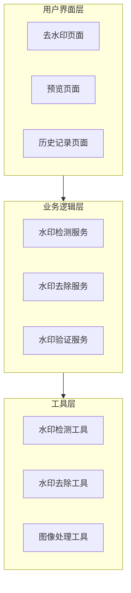

# 微信小程序去除水印功能技术架构与实施方案

## 1. 项目概述

### 1.1 功能目标
在现有 mini-watermaker-photo 微信小程序基础上，添加去除水印功能：
- 去除图片中的可见水印元素（Logo文字、时间地址信息）
- 提取并验证不可见水印信息（LSB隐写的哈希码）
- 提供水印历史管理和恢复功能
- 支持批量水印处理

### 1.2 技术挑战
- 微信小程序 Canvas API 限制
- 复杂背景下的水印识别与去除
- 图像修复算法的性能优化
- 保持原图质量的同时去除水印

## 2. 技术架构设计

### 2.1 整体架构



### 2.2 核心模块设计

#### 2.2.1 水印检测模块
```javascript
// utils/watermark-detector.js
class WatermarkDetector {
  /**
   * 检测可见水印区域
   * 基于当前项目的水印位置（左上角Logo、左下角信息）
   */
  detectVisibleWatermark(imageData) {
    const regions = []
    
    // 检测左上角Logo区域
    const logoRegion = this.detectLogoRegion(imageData)
    if (logoRegion) regions.push(logoRegion)
    
    // 检测左下角信息区域
    const infoRegion = this.detectInfoRegion(imageData)
    if (infoRegion) regions.push(infoRegion)
    
    return regions
  }
  
  /**
   * 提取不可见水印（LSB隐写）
   * 从图片右下角区域提取哈希码
   */
  extractInvisibleWatermark(imageData) {
    const { width, height, data } = imageData
    const regionSize = Math.min(50, width / 10, height / 10)
    const x = width - regionSize
    const y = height - regionSize
    
    // 提取LSB数据
    let binaryString = ''
    for (let i = 0; i < 32; i++) {
      const pixelIndex = i * 4
      if (pixelIndex < regionSize * regionSize * 4) {
        const lsb = data[pixelIndex] & 1
        binaryString += lsb
      }
    }
    
    const hashCode = parseInt(binaryString, 2).toString(16).toUpperCase()
    return { hashCode, isValid: hashCode.length === 8 }
  }
}
```

#### 2.2.2 水印去除模块
```javascript
// utils/watermark-remover.js
class WatermarkRemover {
  /**
   * 去除可见水印
   */
  async removeVisibleWatermark(imageData, watermarkRegions) {
    const result = new ImageData(
      new Uint8ClampedArray(imageData.data), 
      imageData.width, 
      imageData.height
    )
    
    for (const region of watermarkRegions) {
      await this.inpaintRegion(result, region)
    }
    
    return result
  }
  
  /**
   * 区域修复算法
   */
  async inpaintRegion(imageData, region) {
    const { x, y, width, height } = region
    
    // 使用边界像素平均值进行简单修复
    const boundaryPixels = this.getBoundaryPixels(imageData, region)
    const avgColor = this.calculateAverageColor(boundaryPixels)
    
    // 填充区域
    for (let dy = 0; dy < height; dy++) {
      for (let dx = 0; dx < width; dx++) {
        const pixelIndex = ((y + dy) * imageData.width + (x + dx)) * 4
        if (pixelIndex < imageData.data.length) {
          imageData.data[pixelIndex] = avgColor.r
          imageData.data[pixelIndex + 1] = avgColor.g
          imageData.data[pixelIndex + 2] = avgColor.b
          imageData.data[pixelIndex + 3] = 255
        }
      }
    }
  }
  
  /**
   * 清除不可见水印
   */
  removeInvisibleWatermark(imageData) {
    const { width, height, data } = imageData
    const regionSize = Math.min(50, width / 10, height / 10)
    const x = width - regionSize
    const y = height - regionSize
    
    // 清零红色通道最低位
    for (let dy = 0; dy < regionSize; dy++) {
      for (let dx = 0; dx < regionSize; dx++) {
        const pixelIndex = ((y + dy) * width + (x + dx)) * 4
        if (pixelIndex < data.length) {
          data[pixelIndex] = data[pixelIndex] & 0xFE
        }
      }
    }
    
    return imageData
  }
}
```

## 3. 页面架构设计

### 3.1 去水印页面
```javascript
// pages/watermark-remover/watermark-remover.js
Page({
  data: {
    originalImage: null,
    processedImage: null,
    isProcessing: false,
    processingProgress: 0,
    detectedWatermarks: [],
    extractedWatermark: null,
    removeOptions: {
      removeVisible: true,
      removeInvisible: true,
      qualityLevel: 'high'
    }
  },
  
  // 选择图片
  async selectImage() {
    try {
      const res = await wx.chooseMedia({ count: 1, mediaType: ['image'] })
      this.setData({ originalImage: res.tempFiles[0].tempFilePath })
      await this.detectWatermarks Auto()
    } catch (error) {
      wx.showToast({ title: '选择图片失败', icon: 'error' })
    }
  },
  
  // 自动检测水印
  async detectWatermarksAuto() {
    this.setData({ isProcessing: true, processingProgress: 20 })
    
    try {
      const imageData = await this.getImageData(this.data.originalImage)
      const detector = new WatermarkDetector()
      
      // 检测可见水印
      const visibleWatermarks = detector.detectVisibleWatermark(imageData)
      
      // 提取不可见水印
      const invisibleWatermark = detector.extractInvisibleWatermark(imageData)
      
      this.setData({
        detectedWatermarks: visibleWatermarks,
        extractedWatermark: invisibleWatermark,
        processingProgress: 100
      })
    } catch (error) {
      wx.showToast({ title: '检测失败', icon: 'error' })
    } finally {
      this.setData({ isProcessing: false })
    }
  },
  
  // 去除水印
  async removeWatermarks() {
    if (!this.data.originalImage) return
    
    this.setData({ isProcessing: true, processingProgress: 0 })
    
    try {
      const imageData = await this.getImageData(this.data.originalImage)
      const remover = new WatermarkRemover()
      
      let result = imageData
      
      // 去除可见水印
      if (this.data.removeOptions.removeVisible && this.data.detectedWatermarks.length > 0) {
        this.setData({ processingProgress: 30 })
        result = await remover.removeVisibleWatermark(result, this.data.detectedWatermarks)
      }
      
      // 去除不可见水印
      if (this.data.removeOptions.removeInvisible) {
        this.setData({ processingProgress: 60 })
        result = remover.removeInvisibleWatermark(result)
      }
      
      // 保存结果
      this.setData({ processingProgress: 90 })
      const processedImagePath = await this.saveImageData(result)
      
      this.setData({
        processedImage: processedImagePath,
        processingProgress: 100
      })
      
      wx.showToast({ title: '去除成功', icon: 'success' })
    } catch (error) {
      wx.showToast({ title: '处理失败', icon: 'error' })
    } finally {
      this.setData({ isProcessing: false })
    }
  }
})
```

### 3.2 页面布局
```xml
<!-- pages/watermark-remover/watermark-remover.wxml -->
<view class="container">
  <!-- 图片选择 -->
  <view class="image-section">
    <button wx:if="{{!originalImage}}" bindtap="selectImage" class="select-btn">
      选择要去除水印的图片
    </button>
    <image wx:else src="{{originalImage}}" class="preview-image" mode="aspectFit"/>
  </view>
  
  <!-- 检测结果 -->
  <view wx:if="{{detectedWatermarks.length > 0}}" class="detection-panel">
    <text class="panel-title">检测到的水印：</text>
    <view wx:for="{{detectedWatermarks}}" wx:key="index" class="watermark-item">
      <text>{{item.type}} - 位置: {{item.position}}</text>
    </view>
  </view>
  
  <!-- 不可见水印信息 -->
  <view wx:if="{{extractedWatermark && extractedWatermark.isValid}}" class="invisible-panel">
    <text class="panel-title">不可见水印信息：</text>
    <text class="hash-code">哈希码: {{extractedWatermark.hashCode}}</text>
  </view>
  
  <!-- 处理选项 -->
  <view class="options-panel">
    <label class="option-item">
      <checkbox checked="{{removeOptions.removeVisible}}" bindchange="onVisibleChange"/>
      去除可见水印
    </label>
    <label class="option-item">
      <checkbox checked="{{removeOptions.removeInvisible}}" bindchange="onInvisibleChange"/>
      去除不可见水印
    </label>
  </view>
  
  <!-- 操作按钮 -->
  <view class="action-buttons">
    <button class="primary-btn" 
            bindtap="removeWatermarks"
            disabled="{{!originalImage || isProcessing}}">
      {{isProcessing ? '处理中...' : '去除水印'}}
    </button>
  </view>
  
  <!-- 进度条 -->
  <progress wx:if="{{isProcessing}}" 
            percent="{{processingProgress}}" 
            stroke-width="4" 
            color="#007AFF"/>
  
  <!-- 结果对比 -->
  <view wx:if="{{processedImage}}" class="result-section">
    <text class="section-title">处理结果对比：</text>
    <view class="comparison">
      <view class="image-container">
        <text class="image-label">原图</text>
        <image src="{{originalImage}}" mode="aspectFit" class="compare-image"/>
      </view>
      <view class="image-container">
        <text class="image-label">去水印后</text>
        <image src="{{processedImage}}" mode="aspectFit" class="compare-image"/>
      </view>
    </view>
    
    <button class="save-btn" bindtap="saveToAlbum">保存到相册</button>
  </view>
</view>
```

## 4. 核心工具函数

### 4.1 图像处理工具
```javascript
// utils/image-processor.js
class ImageProcessor {
  /**
   * 从文件路径获取ImageData
   */
  async getImageDataFromPath(imagePath) {
    return new Promise((resolve, reject) => {
      const query = wx.createSelectorQuery()
      query.select('#hiddenCanvas').node().exec((res) => {
        if (!res[0] || !res[0].node) {
          reject(new Error('获取Canvas失败'))
          return
        }
        
        const canvas = res[0].node
        const ctx = canvas.getContext('2d')
        
        wx.getImageInfo({
          src: imagePath,
          success: (imageInfo) => {
            canvas.width = imageInfo.width
            canvas.height = imageInfo.height
            
            const img = canvas.createImage()
            img.onload = () => {
              ctx.drawImage(img, 0, 0)
              const imageData = ctx.getImageData(0, 0, canvas.width, canvas.height)
              resolve(imageData)
            }
            img.onerror = reject
            img.src = imagePath
          },
          fail: reject
        })
      })
    })
  }
  
  /**
   * 将ImageData保存为临时文件
   */
  async saveImageDataToFile(imageData) {
    return new Promise((resolve, reject) => {
      const query = wx.createSelectorQuery()
      query.select('#hiddenCanvas').node().exec((res) => {
        const canvas = res[0].node
        const ctx = canvas.getContext('2d')
        
        canvas.width = imageData.width
        canvas.height = imageData.height
        ctx.putImageData(imageData, 0, 0)
        
        wx.canvasToTempFilePath({
          canvas: canvas,
          success: (result) => resolve(result.tempFilePath),
          fail: reject
        })
      })
    })
  }
}
```

### 4.2 水印检测算法
```javascript
// 检测左上角Logo区域
detectLogoRegion(imageData) {
  const { width, height, data } = imageData
  
  // 搜索区域：左上角1/4区域
  const searchWidth = Math.floor(width * 0.25)
  const searchHeight = Math.floor(height * 0.25)
  
  // 查找深色背景（水印背景）
  for (let y = 20; y < searchHeight; y += 5) {
    for (let x = 20; x < searchWidth; x += 5) {
      const region = this.analyzeRegion(data, x, y, width, height, 100, 40)
      if (region.isDarkBackground && region.hasText) {
        return {
          type: 'logo',
          position: 'top-left',
          x: region.x,
          y: region.y,
          width: region.width,
          height: region.height,
          confidence: region.confidence
        }
      }
    }
  }
  
  return null
}

// 检测左下角信息区域
detectInfoRegion(imageData) {
  const { width, height, data } = imageData
  
  // 搜索区域：左下角1/4区域
  const searchWidth = Math.floor(width * 0.6)
  const searchHeight = Math.floor(height * 0.25)
  const startY = height - searchHeight
  
  // 查找半透明背景区域
  for (let y = startY; y < height - 20; y += 5) {
    for (let x = 20; x < searchWidth; x += 5) {
      const region = this.analyzeRegion(data, x, y, width, height, 400, 100)
      if (region.isSemiTransparent && region.hasMultilineText) {
        return {
          type: 'info',
          position: 'bottom-left',
          x: region.x,
          y: region.y,
          width: region.width,
          height: region.height,
          confidence: region.confidence
        }
      }
    }
  }
  
  return null
}
```

## 5. 性能优化

### 5.1 分块处理
```javascript
/**
 * 大图像分块处理
 */
async processLargeImage(imageData, options) {
  const chunkSize = 512
  const chunks = this.splitImageIntoChunks(imageData, chunkSize)
  
  const processedChunks = await Promise.all(
    chunks.map(chunk => this.processChunk(chunk, options))
  )
  
  return this.mergeChunks(processedChunks, imageData.width, imageData.height)
}
```

### 5.2 内存管理
```javascript
/**
 * 内存使用监控
 */
class MemoryMonitor {
  checkMemoryUsage() {
    const systemInfo = wx.getSystemInfoSync()
    if (systemInfo.platform === 'ios' && 
        systemInfo.memorySize && 
        systemInfo.memorySize < 100) {
      wx.showToast({
        title: '内存不足，建议清理后台应用',
        icon: 'none'
      })
    }
  }
}
```

## 6. 实施计划

### 6.1 开发阶段
1. **第一阶段**（1周）：水印检测算法实现
2. **第二阶段**（1周）：水印去除算法实现
3. **第三阶段**（1周）：页面集成和用户界面
4. **第四阶段**（1周）：测试优化和文档

### 6.2 技术限制和解决方案
- **性能限制**：采用分块处理和简化算法
- **效果限制**：提供多种算法选择和手动调整
- **兼容限制**：针对不同设备做适配优化

这个方案充分利用了现有项目的水印实现机制，针对特定的水印模式设计了高效的检测和去除算法，同时考虑了微信小程序的技术限制，提供了可行的实施路径。